Ubuntu 26.04 was recently released. This is a long-term support (LTS) release that will serve as the primary Ubuntu version for the next few years. There are not many visible desktop changes this time. The interface has been slightly modified, GNOME has been updated, several default applications have been replaced, the firmware distribution format has changed, and the Software & Updates utility has been removed from the default installation.

In this article, I will show how to configure Ubuntu 26.04 after installation. I will cover how to set up new system components, add Flatpak support, install frequently used applications, restore Software & Updates, and configure the GNOME environment.

## Ubuntu 26.04 Post-Installation Setup

Wherever possible, I will provide both GUI instructions and terminal commands. This makes the setup easier to repeat, run quickly, or even automate with a script. I will be describing the Ubuntu setup on a desktop PC for daily use. I will also skip the section on installing drivers.

### Step 1. Setting Up the Desktop Background

Let's start by changing the desktop background to something more appealing than the default image. To do this, open the context menu on the desktop and select **Change Background**:

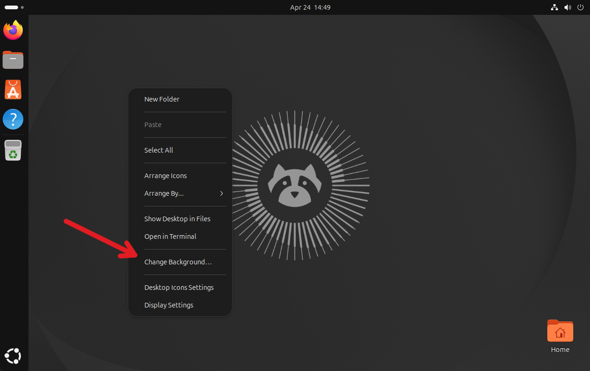

In the window that opens, scroll down slightly and select an image you like in the Background section. For example, this one:

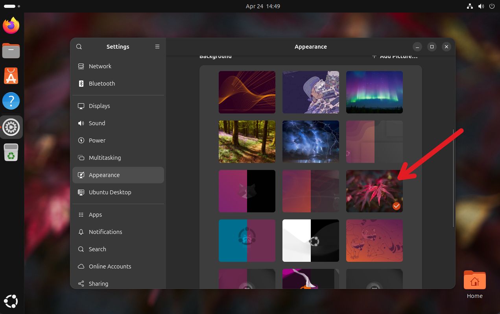

To select this same image in the terminal, run the following commands:

```
gsettings set org.gnome.desktop.background picture-uri 'file:///usr/share/backgrounds/mendhak-Red_Acer.jpg'
```

```
gsettings set org.gnome.desktop.background picture-uri-dark 'file:///usr/share/backgrounds/mendhak-Red_Acer.jpg'
```

```
gsettings set org.gnome.desktop.screensaver picture-uri 'file:///usr/share/backgrounds/mendhak-Red_Acer.jpg'
```

### Step 2. Enable Dark Theme

In the same window, you can enable the dark theme and select an accent color. These settings are located at the top of the window:

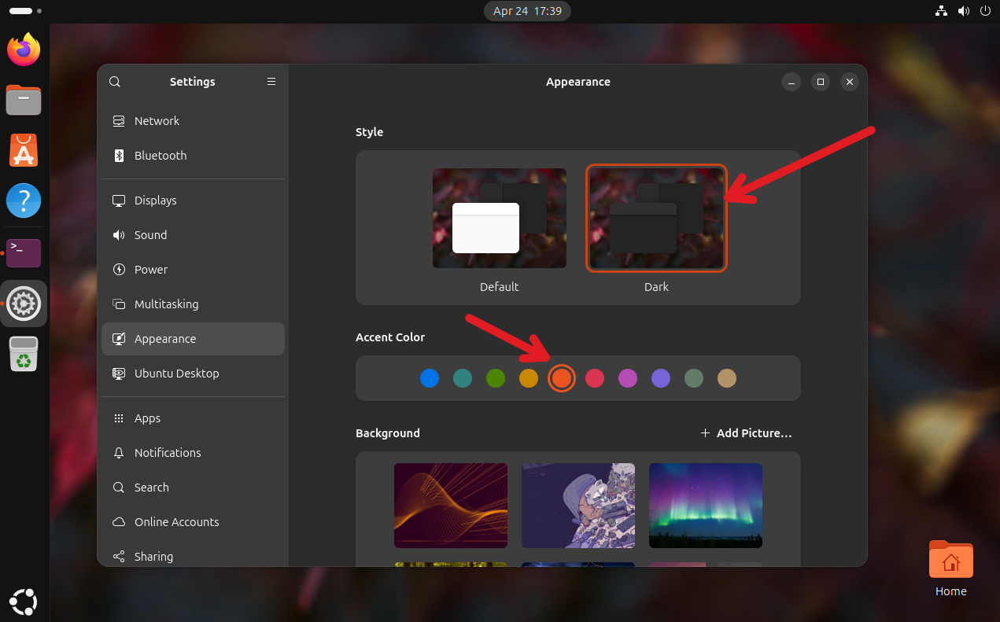

To enable the dark theme using the terminal, run the following commands:

```
gsettings set org.gnome.desktop.interface color-scheme prefer-dark
```

```
gsettings set org.gnome.desktop.interface gtk-theme Yaru-dark
```

```
gsettings set org.gnome.desktop.interface icon-theme Yaru-dark
```

### Step 3. System Update

Since the release of the image you used, new package versions containing bug fixes may have become available. Therefore, before installing anything, it is recommended to update the system. To do this, first update the package list:

```
sudo apt update
```

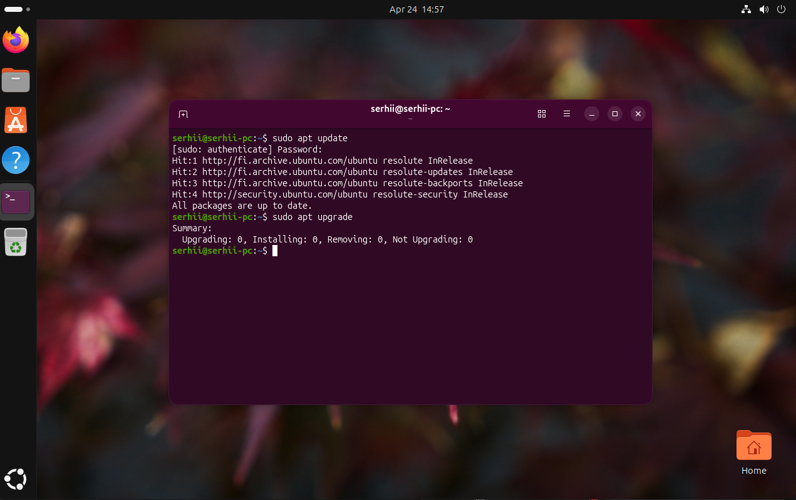

Then update the packages themselves to the new version:

```
sudo apt upgrade
```

To update snap packages, use the following command:

```
sudo snap refresh
```

The following command will reboot the computer if necessary:

```
[ -f /var/run/reboot-required ] && sudo reboot
```

### Step 4. Installing Software & Updates

The Software & Updates utility, which was previously used in Ubuntu for managing repositories, is no longer included by default. However, the universe, multiverse, and restricted repositories are enabled by default anyway, even if you did not choose to install proprietary software during Ubuntu installation. If you still want to install it, run the following command:

```
sudo apt install software-properties-gtk
```

After this, the utility can be found in the main menu.

### Step 5. Migrating to amd64v3 Packages

Ubuntu 26.04 repositories now contain package versions for the amd64v3 architecture. This is still x86_64, but it uses newer instruction sets available on modern processors. This is unlikely to yield a significant performance boost in everyday use, but it can be useful for compute-intensive tasks. First, check whether your processor supports this architecture; the following command should show x86-64-v3 marked as supported:

```
/lib64/ld-linux-x86-64.so.2 --help | grep  x86-64
```

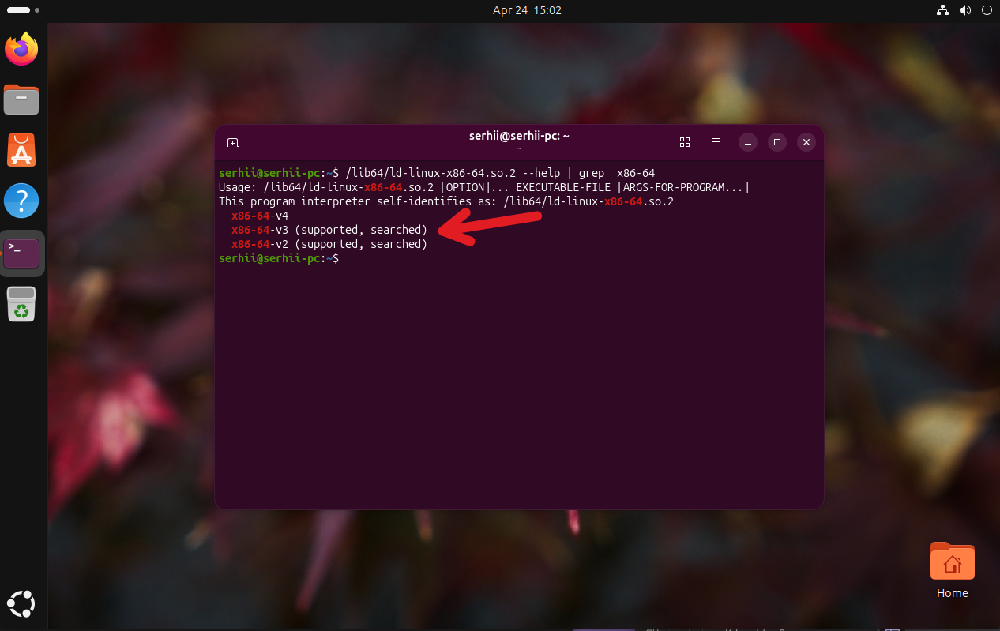

To enable downloading packages with the new architecture, run the following command:

```
echo 'APT::Architecture-Variants "amd64v3";' | sudo tee /etc/apt/apt.conf.d/99amd64v3
```

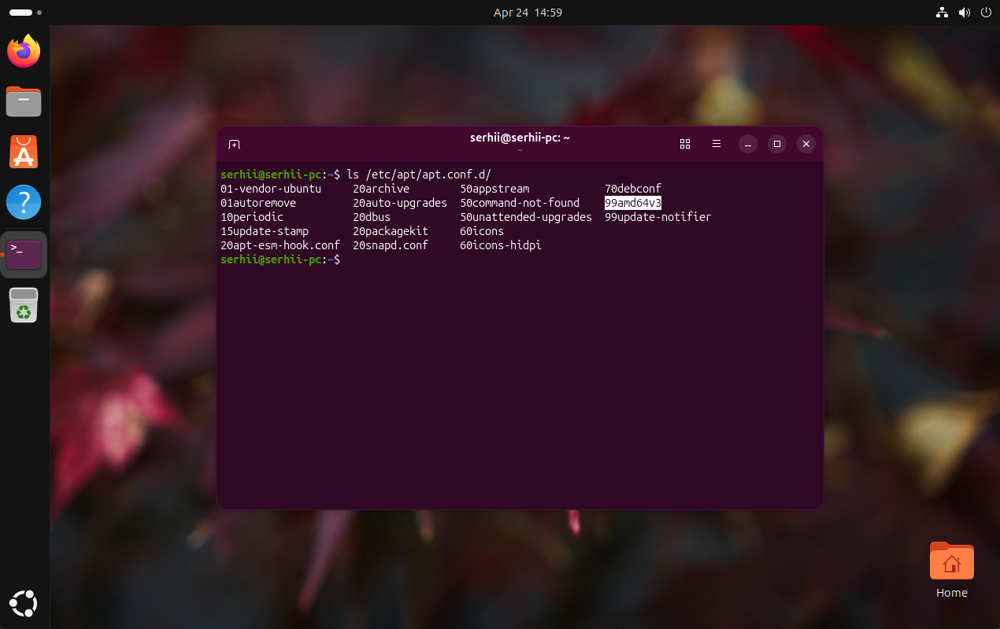

This command will create the file 99amd64v3 in the /etc/apt/apt.conf.d/ directory. Now you need to update the system again:

```
sudo apt update
```

```
sudo apt upgrade
```

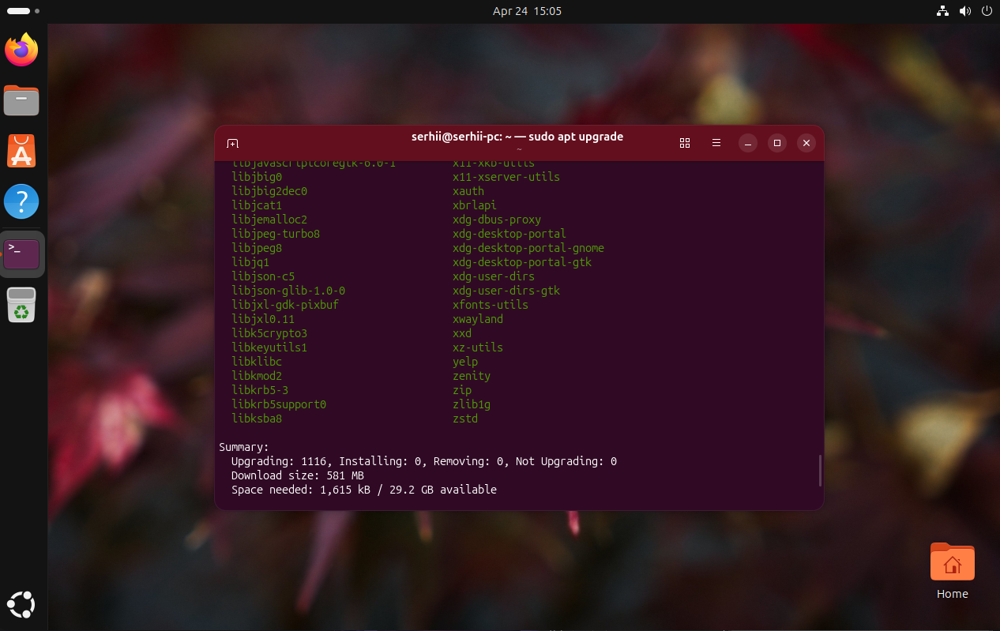

If something goes wrong and you want to revert to the default version, delete the file /etc/apt/apt.conf.d/99amd64v3 and repeat the update:

```
sudo rm /etc/apt/apt.conf.d/99amd64v3
```

### Step 6. Removing Unnecessary Firmware

Since Canonical developers have split the firmware package into 17 different vendor-specific packages, you can now remove the firmware you don't need. You can view the list of all packages using the command:

```
apt list --installed | grep firmware
```

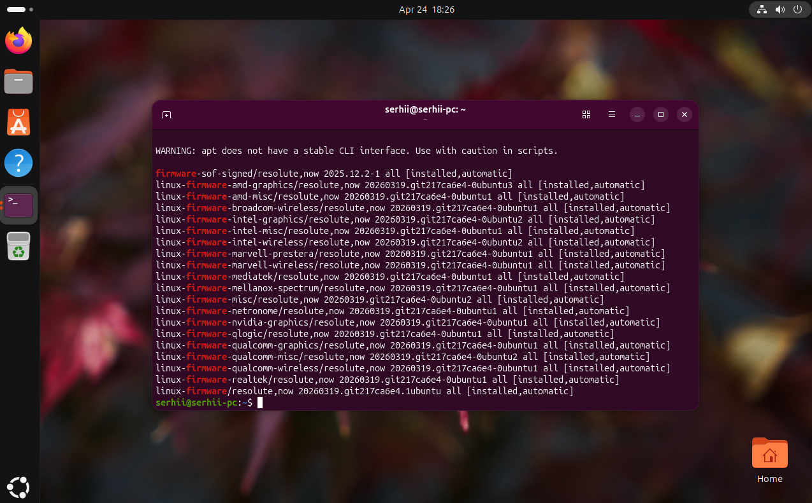

Now you can remove packages for manufacturers whose hardware you do not use. Here is the command that will remove firmware for manufacturers rarely found on home computers. However, before executing it, check the list to ensure you do not remove anything you need:

```
sudo apt purge linux-firmware-qualcomm-graphics linux-firmware-qualcomm-misc linux-firmware-qualcomm-wireless linux-firmware-mediatek linux-firmware-marvell-wireless linux-firmware-marvell-prestera linux-firmware-mellanox-spectrum linux-firmware-netronome
```

### Step 7. Configuring sudo-rs

Starting with Ubuntu 25.10, Ubuntu uses sudo-rs. This is an alternative implementation of sudo written in Rust. The previous version of sudo is also available on the system under the name sudo.ws. To verify that the Rust version is being used, run:

```
sudo --version
```

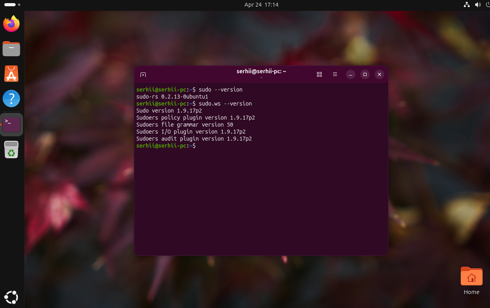

In this version, the developers have slightly changed the default behavior. Now sudo displays asterisks when you enter your password. If you are used to the traditional behavior where password input is completely hidden, add the following line to the end of the /etc/sudoers file:

```
sudo visudo
```

```
Defaults !pwfeedback
```

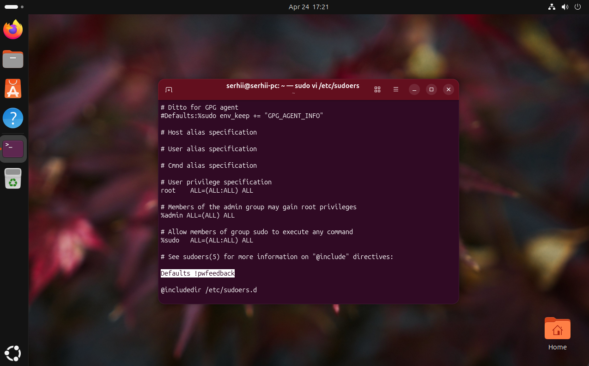

Afterwards, asterisks will no longer be displayed. If you want to switch back to GNU sudo, you can use the update-alternatives script:

```
sudo update-alternatives --config sudo
```

After that, you will need to select the appropriate number:

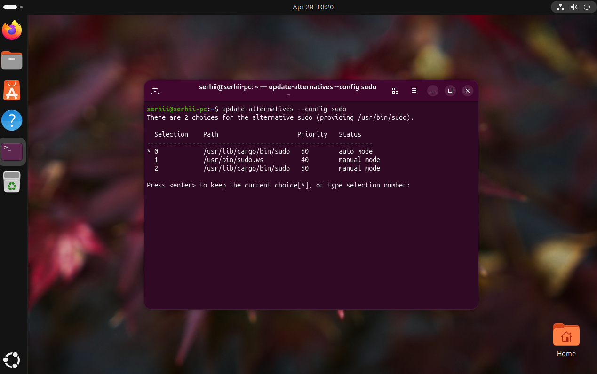

### Step 8. Configuring Coreutils

In Ubuntu 26.04, Rust rewrites from the uutils package are used for some coreutils utilities. The `cp`, `mv`, and `rm` commands still come from GNU coreutils because their Rust alternatives still have several unresolved issues. You can verify this by running the following commands:

```
ls --version
```

```
cp --version
```

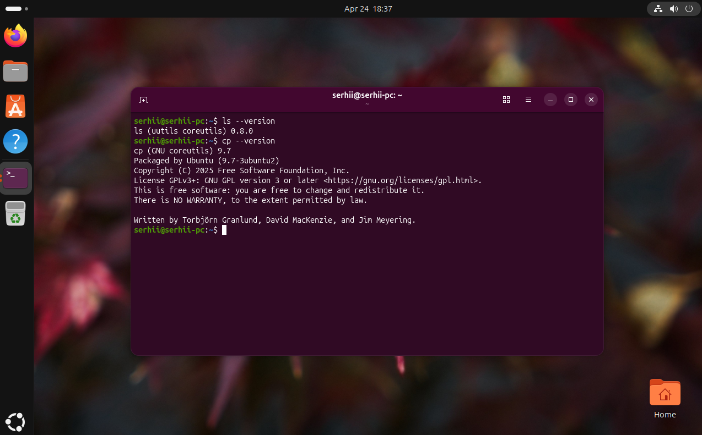

However, the versions of the utilities from the coreutils package are still present on the system. In 95% of cases, you won't notice the difference. But if you still need to use the GNU version of any utility, they are all located in the /usr/bin directory with the gnu prefix:

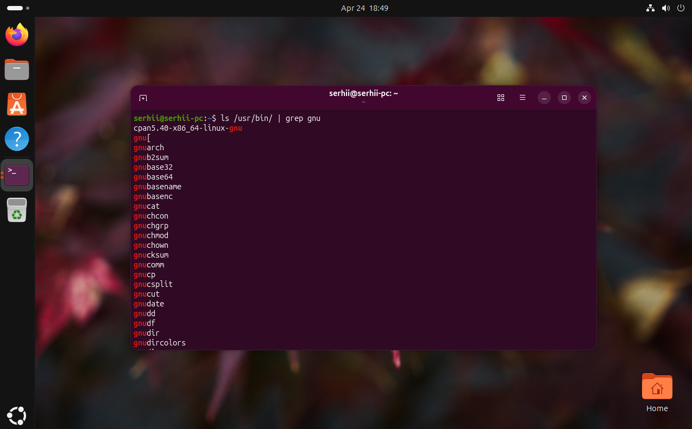

There are currently several packages for coreutils:

- **coreutils-from-uutils** - uutils, contains binaries such as /usr/bin/ls
- **gnu-coreutils** - original coreutils, contains binaries with the gnu prefix, for example /usr/bin/gnuls
- **coreutils-from-gnu** - original coreutils, contains binaries without the prefix, for example /usr/bin/ls

If you want to use GNU coreutils as before, install the coreutils-from-gnu package. The update-alternatives method will not work here. To do this, first set a lower priority for the uutils package:

```
sudo vi /etc/apt/preferences.d/uutils
```

```
Package: coreutils-from-uutils
Pin: release a=*
Pin-Priority: -10
```

Then install GNU coreutils:

```
sudo apt install coreutils-from-gnu coreutils-from-uutils- --allow-remove-essential
```

Do this only if necessary. In most cases, it is not worth switching back from uutils.

### Step 9. Configuring Active Corners

In GNOME, you can open the "Overview" screen by moving the cursor to the top-left corner. To do this, enable the **Hot Corner** option on the **Multitasking** tab:

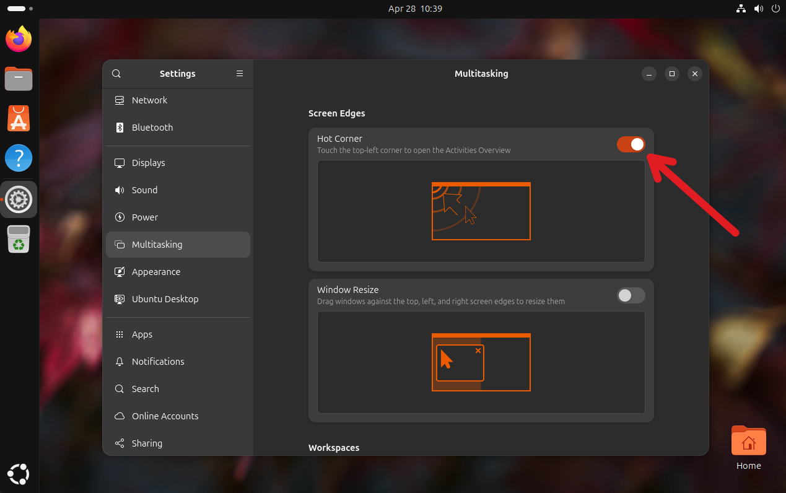

Or run the following command:

```
gsettings set org.gnome.desktop.interface enable-hot-corners true
```

There is also an **Active Screen Edges** option here, but it does not need to be enabled, as Ubuntu already uses its own Tiling Assistant extension for these purposes.

### Step 10. Configuring Window Switching Using Alt+Tab

By default, when using Alt+Tab, applications will switch between all workspaces. To switch within a single workspace, select **Include apps from current workspace only** for the **App Switching** setting on the **Multitasking** tab:

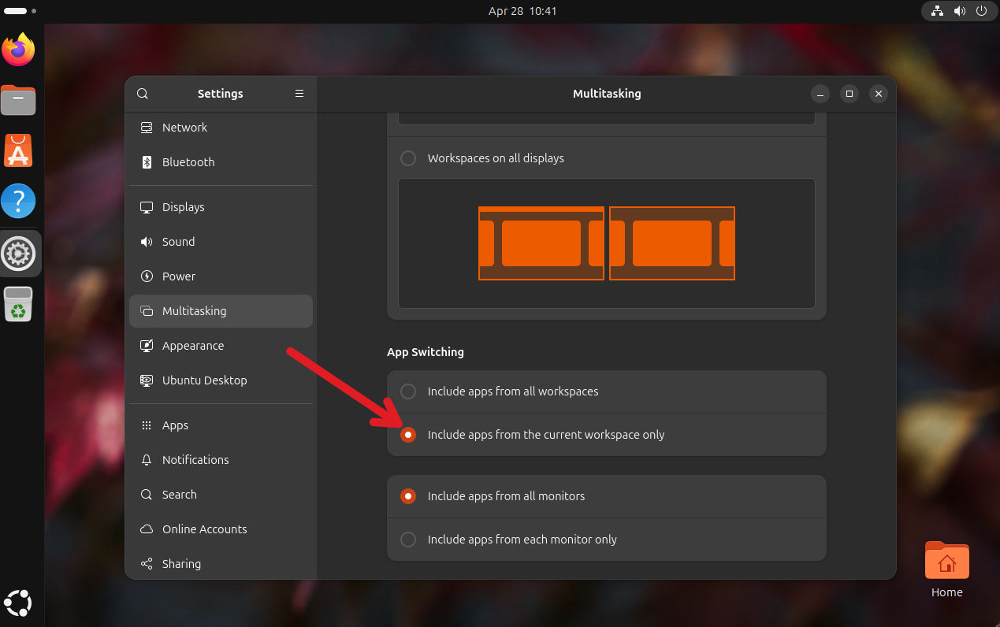

Or run this command:

```
gsettings set org.gnome.shell.app-switcher current-workspace-only true
```

### Step 11. Hiding the Home Folder Shortcut

You can hide the home folder shortcut on the **Ubuntu Desktop** tab. To do this, set the **Show Desktop Folder** toggle to the off position:

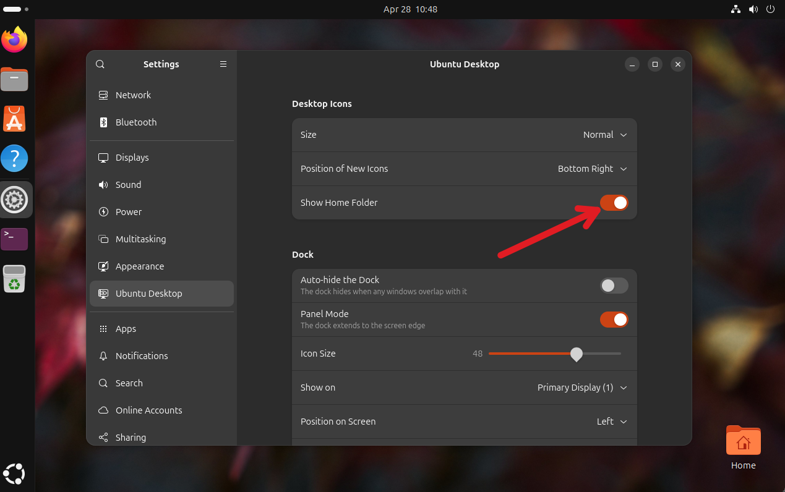

You can also do this by running the command:

```
gsettings set org.gnome.shell.extensions.ding show-home false
```

### Step 12. Configuring Nautilus

In order to create new files via the Nautilus context menu, you need to create template files in the Templates directory. For example, for the most common file types:

```
touch ~/Templates/new_file.md
```

```
touch ~/Templates/new_file.txt
```

```
echo -n '#!/bin/bash' > ~/Templates/new_script.sh
```

The result will look like this:

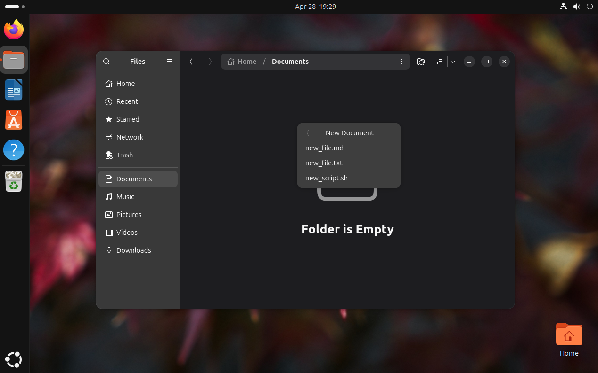

To make Nautilus sort by type by default and keep folders on top, execute the following command:

```
gsettings set org.gnome.nautilus.preferences default-sort-order 'type'
```

### Step 13. Disabling Sleep Mode

You can disable the computer from entering sleep mode after a certain period of inactivity on the **Power** tab using the **Automatic Suspend** option. The same can be done using the command:

```
gsettings set org.gnome.settings-daemon.plugins.power sleep-inactive-ac-timeout 0
```

Since this setting applies only to the current user, you need to do the same for gdm to prevent the computer from entering sleep mode on the login screen:

```
sudo -u gdm dbus-run-session gsettings set org.gnome.settings-daemon.plugins.power sleep-inactive-ac-timeout 0
```

### Step 14. Disabling Screen Lock

Screen lock is disabled in the settings, on the **Privacy & Security** tab in the **Screen Lock** section using the **Automatic Screen Lock** option:

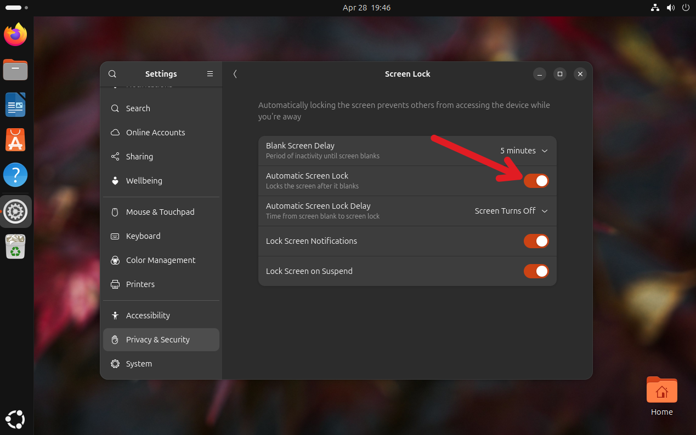

The same can be done by executing:

```
gsettings set org.gnome.desktop.screensaver lock-enabled false
```

### Step 15. Automatically Emptying the Trash

To automatically empty the trash by deleting files that have been there for more than 30 days, go to the **Privacy & Security** tab, select **File History & Trash**, and in the **Trash & Temporary Files** section, enable the **Automatically Delete Trash Content** option:

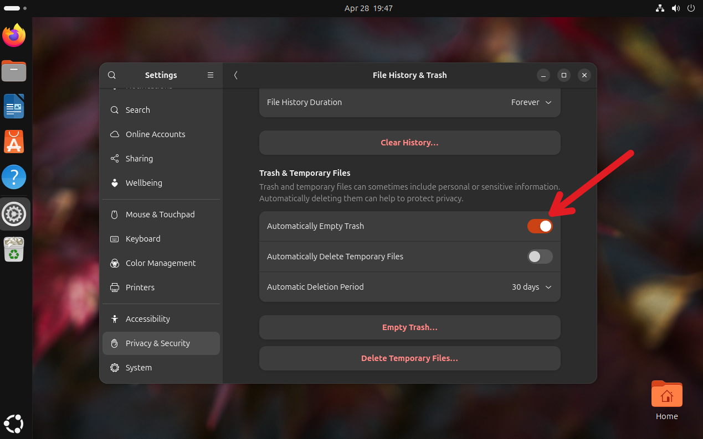

Or run the following command:

```
gsettings set org.gnome.desktop.privacy remove-old-trash-files true
```

### Step 16. Configuring Search Sources

To remove unnecessary items from the search on the "Overview" screen, open the **Search** tab in settings and disable any providers you do not need in the **Search Results** list:

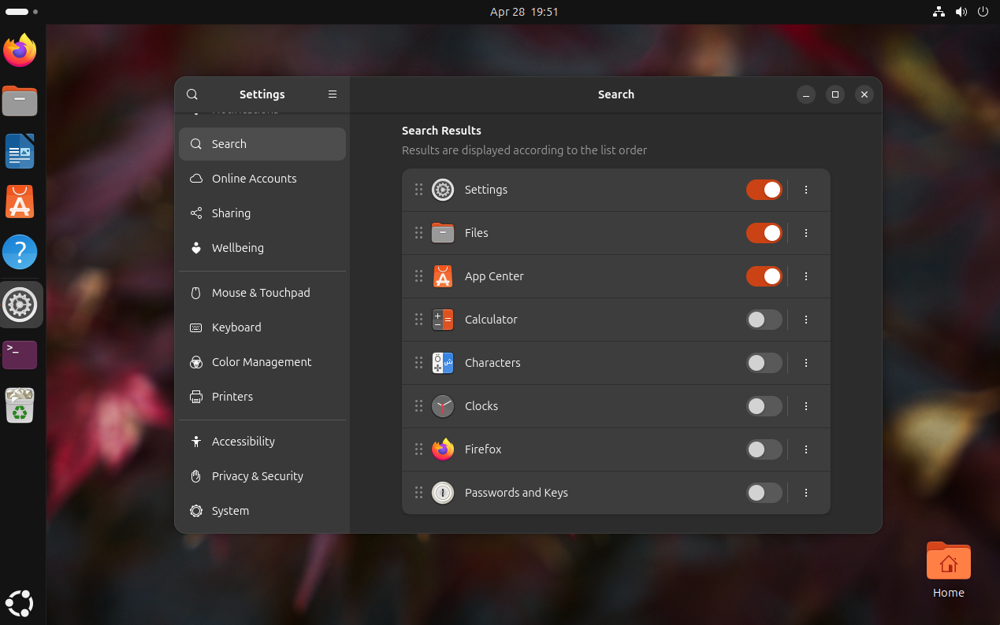

In gsettings, all providers are enabled by default, and to disable them, you need to add them to the exceptions:

```
gsettings set org.gnome.desktop.search-providers disabled " ['org.gnome.seahorse.Application.desktop', 'org.gnome.clocks.desktop', 'org.gnome.Characters.desktop', 'org.gnome.Calculator.desktop']"
```

The result will look like this:

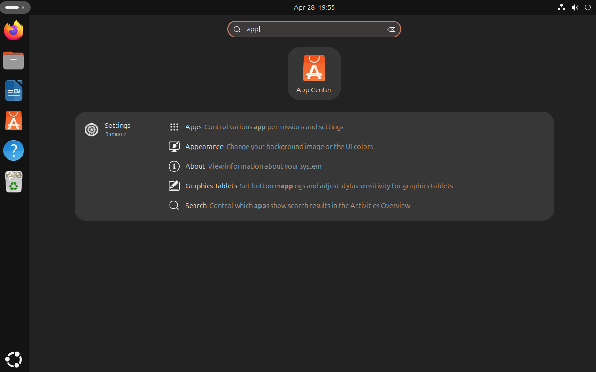

### Step 17. Installing Extensions

To install GNOME extensions, it is convenient to use the GNOME Extension Manager. To install it, run the following command:

```
sudo apt install gnome-shell-extension-manager
```

The application has two tabs. On the first, you can view and configure installed extensions, and on the second, browse the catalog of extensions available for installation:

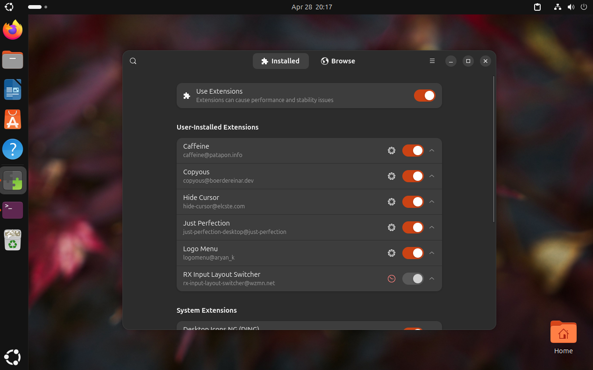

To install an extension, type its name in the search bar, then click the **Install** button next to its name:

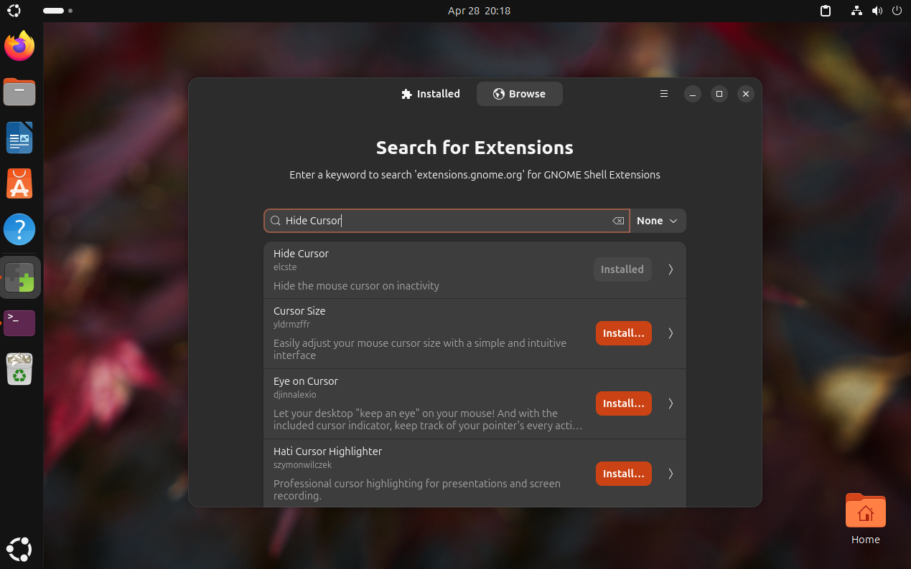

Here are some extensions that make working in GNOME more convenient:

- **Logo Menu** - adds a menu with the distribution logo in addition to the main GNOME menu. A useful feature is the ability to force quit an application, as could previously be done using xkill.
- **Caffeine** - prevents the screen from turning off when you are watching videos.
- **Hide Cursor** - hides the cursor after a few seconds of inactivity.
- **Just Perfection** - contains many settings for the desktop environment.
- **Copyous** - a clipboard manager that can open a dialog next to the cursor.
- **RX Layout Switcher** - enables switching the keyboard layout using Alt+Shift.

Since Ubuntu 26.04 has just been released, developers may not have released updates for some extensions. However, they are fully compatible. To be able to install incompatible extensions, you need to disable the compatibility check using the following command:

```
gsettings set org.gnome.shell disable-extension-version-validation true
```

Be careful with this step. Do not install extensions that have not been updated for many years, as this could break your desktop environment. This feature should be used temporarily, only for extensions that are highly likely to work.

### Step 18. Just Perfection Configuration

Using the Just Perfection extension, you can replace a number of different extensions designed for customizing the desktop appearance. It allows you to hide interface elements, rearrange their placement, and modify their behavior and size. You can open the extension settings in **Extension Manager**.

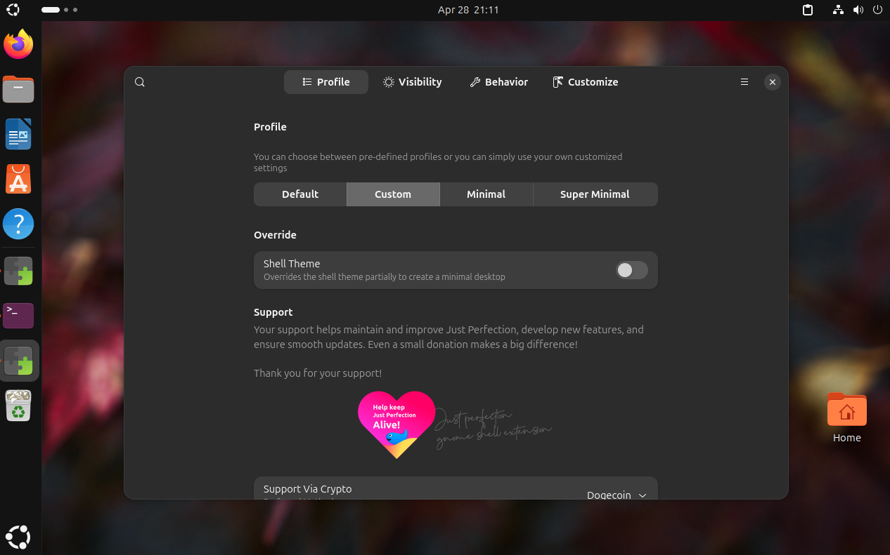

There are several profiles with default settings here, and you can also configure everything manually in the Custom profile. Let's look at how to configure several settings via the terminal. To open the desktop directly instead of the "Overview" screen, run the following command:

```
gsettings --schemadir ~/.local/share/gnome-shell/extensions/just-perfection-desktop\@just-perfection/schemas/ set org.gnome.shell.extensions.just-perfection startup-status 0
```

This command will move the panel to the bottom of the screen:

```
gsettings --schemadir ~/.local/share/gnome-shell/extensions/just-perfection-desktop\@just-perfection/schemas/ set org.gnome.shell.extensions.just-perfection top-panel-position 1
```

And this command will make notifications appear at the bottom and center:

```
gsettings --schemadir ~/.local/share/gnome-shell/extensions/just-perfection-desktop\@just-perfection/schemas/ set org.gnome.shell.extensions.just-perfection notification-banner-position 4
```

### Step 19. Installing Flatpak and Bazaar

By default, Ubuntu supports only Snap packages. To add Flatpak support, run the following command:

```
sudo apt install flatpak
```

After that, add the Flathub repository:

```
flatpak remote-add --if-not-exists flathub https://dl.flathub.org/repo/flathub.flatpakrepo
```

After that, you should restart the computer, and then you can install Flatpak packages in the terminal. However, to manage such packages in a graphical interface, it is better to use the Bazaar software center. To install it, run:

```
flatpak install flathub io.github.kolunmi.Bazaar
```

The issue with [Fusermount and AppArmor](https://bugs.launchpad.net/ubuntu/+source/apparmor/+bug/2130388), which prevented the program from working in Ubuntu 25.10, remains unfixed. Therefore, to get everything working, you need to disable the AppArmor profile for Fusermount:

```
sudo ln -s /etc/apparmor.d/fusermount3 /etc/apparmor.d/disable/
```

```
sudo apparmor_parser -R /etc/apparmor.d/fusermount3
```

The program looks like this:

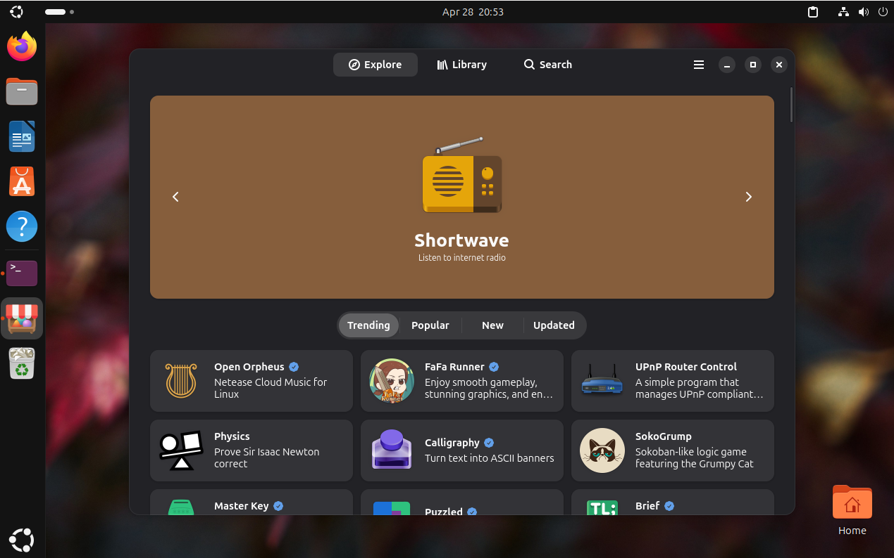

You should also install Flatseal to manage permissions for Flatpak packages:

```
flatpak install flathub com.github.tchx84.Flatseal
```

### Step 20. Installing Refine

To configure additional GNOME parameters, you can use the Refine utility. It can be installed via Bazaar or by running the following command:

```
flatpak install flathub page.tesk.Refine
```

Using the application, you can restore support for pasting text by clicking the mouse wheel on the **Mouse & Touchpad** tab:

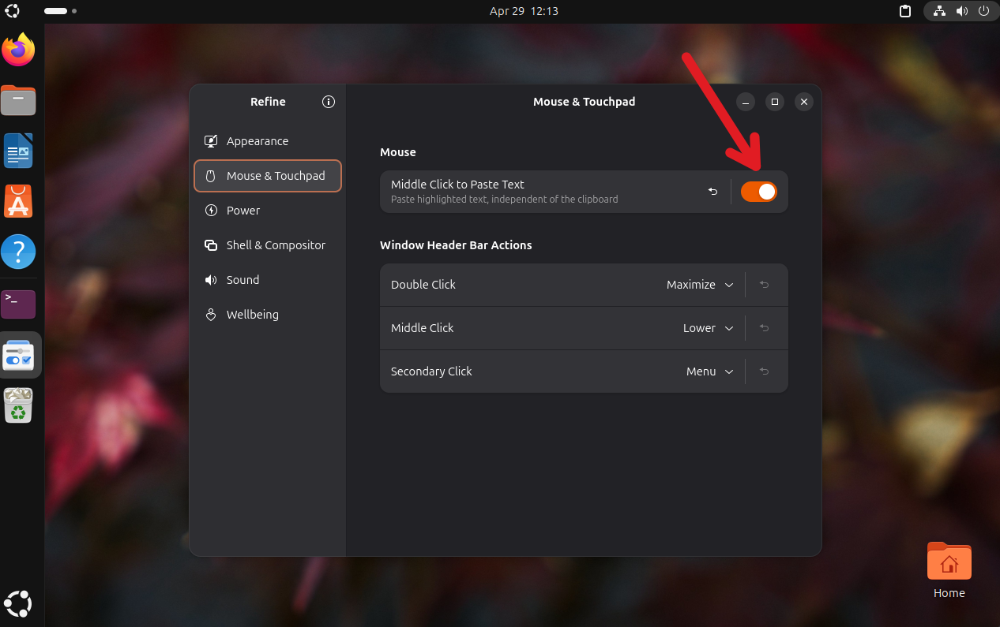

This feature was [disabled](https://gitlab.gnome.org/GNOME/gsettings-desktop-schemas/-/merge_requests/119?ref=itsfoss.com) by default in GNOME 50. This can also be done using the following command:

```
gsettings set org.gnome.desktop.interface gtk-enable-primary-paste true
```

Additionally, on the Power tab, you can enable showing the power button on the lock screen:

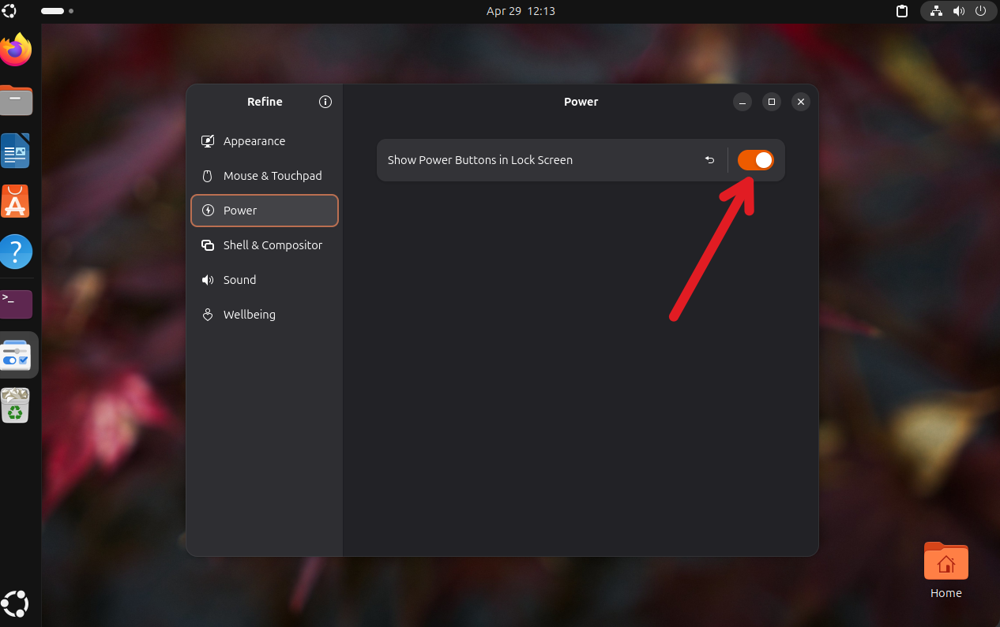

Alternatively, you can run the following command:

```
gsettings set org.gnome.desktop.screensaver restart-enabled true
```

### Step 21. Configuring AppImage

To run older AppImages that require FUSE 2, install this library:

```
sudo apt install libfuse2t64
```

For centralized management of AppImage applications and creating shortcuts for them in the menu, you can use Gear Lever.

```
flatpak install flathub it.mijorus.gearlever
```

The program stores all your AppImage applications in the ~/AppImages directory. After you add an AppImage file to the directory, you can open it from the program's main menu or find its shortcut in the GNOME menu.

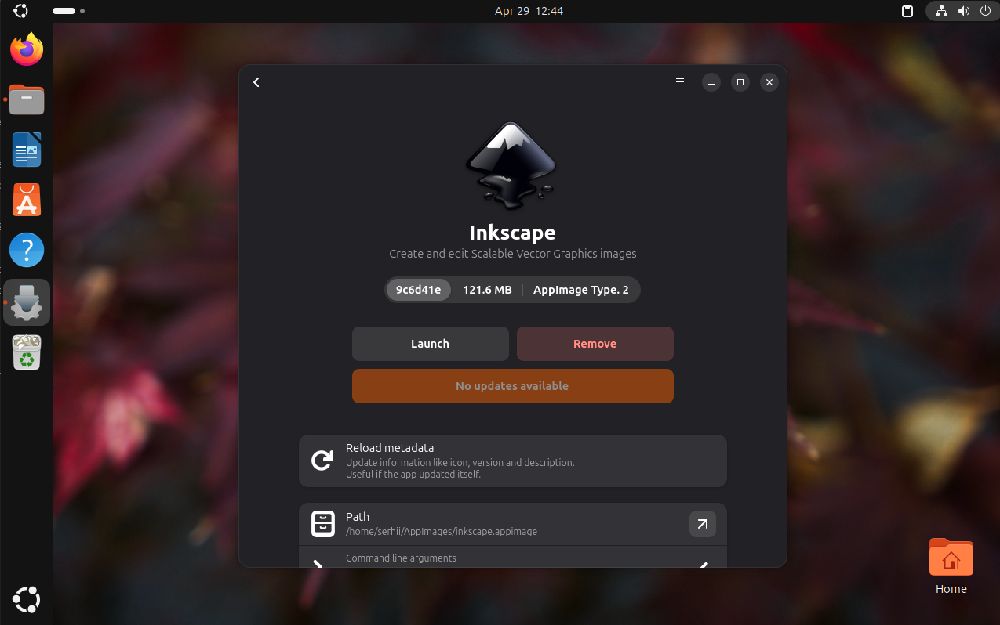

### Step 22. Minimizing Windows from the Dock

In the Unity shell, there was previously an option to minimize windows by clicking the application icon in the Dock. To enable this feature now, run the following command:

```
gsettings set org.gnome.shell.extensions.dash-to-dock click-action minimize
```

### Step 23. Installing Multimedia Codecs

If you did not choose to install multimedia codecs during the Ubuntu installation, but now you need them, they can be installed using the command:

```
sudo apt install ubuntu-restricted-extras
```

Additionally, Ubuntu does not include a plugin for opening images in HEIC format (photos taken on an iPhone) by default. If you need to open such images, run the following command to install the package:

```
sudo apt install libheif-plugin-libde265
```

### Step 24. Switching Keyboard Layout Using Alt+Shift

In Ubuntu and GNOME, Super + Space has been used for switching keyboard layouts for quite a long time. If you want to be able to switch the layout using Alt+Shift, you need to use the RX Layout Switcher extension. At the time of writing this article, it does not officially support GNOME 50, but it works. Most likely, within a few weeks, a version with updated metadata will be released, and support will appear. Meanwhile, you should disable extension compatibility checking as shown in step 17. After that, the extension will work:

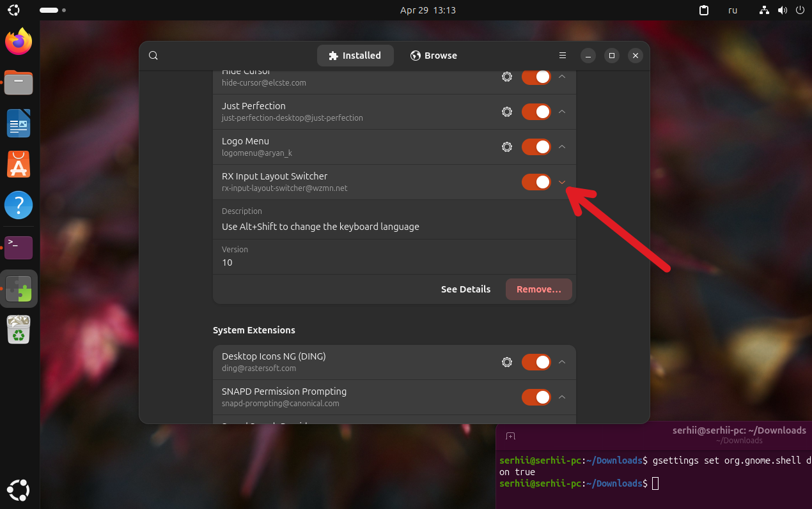

If you need to add keyboard layouts, you can do this in Settings, on the **Keyboard** tab, in the **Input Sources** section:

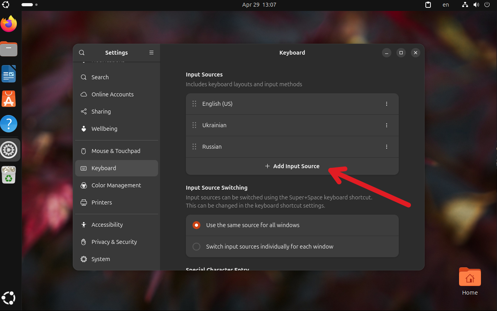

Since the extension for switching layouts does not work on the login screen, you may need the [Primary Input on LockScreen](https://extensions.gnome.org/extension/4727/primary-input-on-lockscreen/) extension, which will set the primary keyboard layout on the login screen.

### Step 25. Browser Installation

By default, Ubuntu comes with Firefox. If you are accustomed to Chrome-based browsers, you can install Brave or Chromium. Execute the following commands to install Brave from the developers' repository:

```
sudo apt install curl
```

```
sudo curl -fsSLo /usr/share/keyrings/brave-browser-archive-keyring.gpg https://brave-browser-apt-release.s3.brave.com/brave-browser-archive-keyring.gpg
```

```
sudo curl -fsSLo /etc/apt/sources.list.d/brave-browser-release.sources https://brave-browser-apt-release.s3.brave.com/brave-browser.sources
```

```
sudo apt update
```

```
sudo apt install brave-browser
```

If you want to use Chromium, you can install it via a snap package, or use the PPA repository from xtradeb:

```
sudo add-apt-repository ppa:xtradeb/apps
```

```
sudo apt update
```

```
sudo apt install chromium
```

Chromium recently added support for vertical tabs, so if that's what you needed, it's now available:

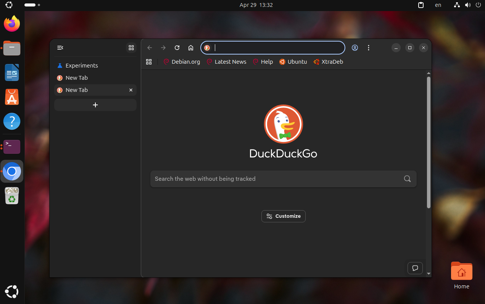

### Step 26. Installing Docker

Docker is commonly used for setting up development environments or running applications with a web interface. To install it on Ubuntu, first add the official repository:

```
sudo curl -fsSL https://download.docker.com/linux/ubuntu/gpg -o /etc/apt/keyrings/docker.asc
```

```
sudo tee /etc/apt/sources.list.d/docker.sources <<EOF
Types: deb
URIs: https://download.docker.com/linux/ubuntu
Suites: $(. /etc/os-release && echo "${UBUNTU_CODENAME:-$VERSION_CODENAME}")
Components: stable
Architectures: $(dpkg --print-architecture)
Signed-By: /etc/apt/keyrings/docker.asc
EOF
```

Then update the package list and install the program components:

```
sudo apt update
```

```
sudo apt install docker-ce docker-ce-cli containerd.io docker-buildx-plugin docker-compose-plugin
```

Next, add the user to the docker group and enable the docker service to start on boot:

```
sudo usermod -aG docker $USER
```

```
sudo systemctl enable --now docker
```

After this, you should log out and log back in. I used the official repository so that you can receive program updates as soon as they are released.

### Step 27. Installing Required Software

Immediately after installing Ubuntu, many programs that might be needed are not included. Here are some programs that can be installed:

- **VLC** - one of the best video players; it is best installed from Flathub, since that version already includes all codecs
- **Gapless** - audio player
- **Obsidian** - Markdown note-taking application
- **GIMP** - image editor
- **Transmission** - torrent client
- **KeePassXC** - password manager
- **LibreOffice** - office suite

Here are the commands for installation:

```
flatpak install flathub org.videolan.VLC
```

```
flatpak install flathub com.github.neithern.g4music
```

```
flatpak install flathub md.obsidian.Obsidian
```

```
sudo apt install gimp transmission libreoffice keepassxc
```

You can also install some utilities that will be useful to you:

- **curl** - downloading files in the terminal
- **vim** - improved version of the vi text editor
- **ncdu** - allows finding the largest files in the file system and freeing up disk space
- **git** - version control system
- **rg** - search within file contents instead of grep
- **htop** - task manager in the terminal
- **unrar** - utility for extracting RAR archives
- **p7zip** - utility for extracting p7zip archives
- **btop** - viewing the list of running processes in the terminal
- **fdfind** - fast search by file names
- **fzf** - fuzzy live search by file names

```
sudo apt install curl vim ncdu git ripgrep htop unrar p7zip btop fd-find fzf
```

## Wrapping Up

In this article, I covered how to set up Ubuntu 26.04 after installation. Many steps are optional; they simply show how to restore what was previously available in Ubuntu or how to improve the GNOME interface.
